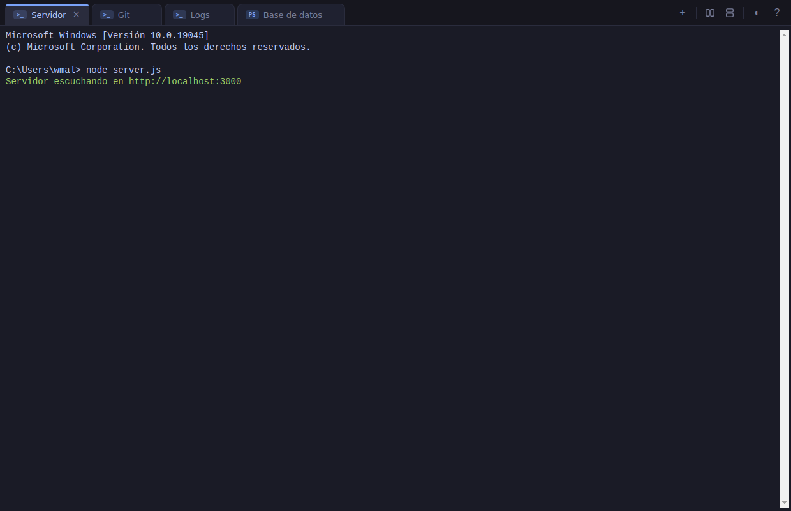
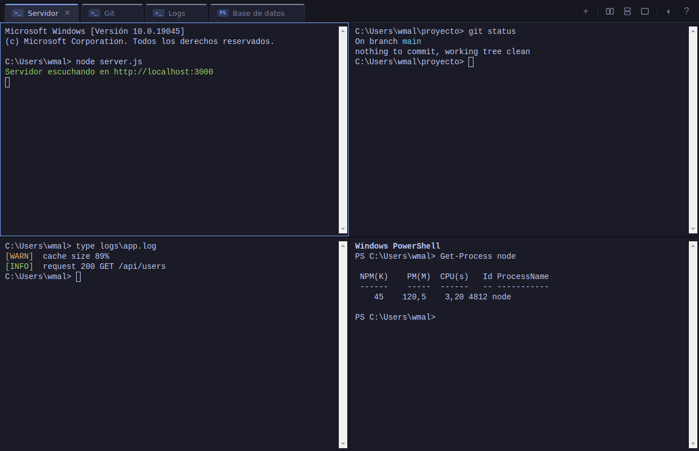
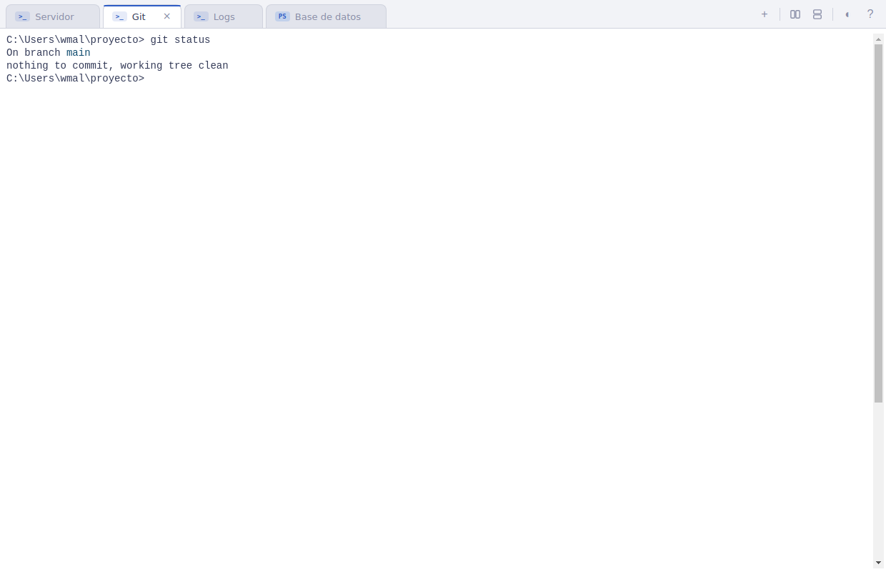

<div align="center">

# TerminalHub

**Gestor de terminales moderno para Windows — múltiples CMD y PowerShell en una sola ventana, con pestañas, splits y temas.**

*A modern tabbed terminal manager for Windows. Portable, no installation required.*




</div>

---

## ¿Qué es?

TerminalHub es una aplicación de escritorio que agrupa todas tus consolas en **una sola ventana**. Cada pestaña es un proceso **real** de `cmd.exe` o `powershell.exe` (vía la API ConPTY de Windows, la misma que usa Windows Terminal), renderizado con [xterm.js](https://xtermjs.org/), el emulador de terminal de VS Code.

Pensada para máquinas donde no puedes instalar nada: **ni Windows Terminal, ni Microsoft Store, ni Node, ni runtimes**. Descargas el zip, lo descomprimes y ejecutas el `.exe`. Ideal para servidores RDP.

### Características

- ✅ Terminales reales de **CMD** y **PowerShell** en pestañas
- ✅ **Renombra** cada pestaña con doble click o `F2` ("Servidor", "Git", "Logs"...)
- ✅ **Reordena** las pestañas arrastrándolas
- ✅ **Splits**: divide la ventana en hasta **8 paneles** en cuadrícula para ver varias terminales a la vez
- ✅ **Tema oscuro** (por defecto) y tema claro
- ✅ **Persistencia**: recuerda títulos, orden de pestañas, shell de cada una y tema al reabrir
- ✅ **Aviso de actualización**: la app te avisa cuando hay una versión nueva para descargar
- ✅ Atajos de teclado para todo
- ✅ Copiar/pegar con teclado o click derecho
- ✅ 100 % **portable**: sin instalador, sin permisos de administrador, sin dependencias

| Varios paneles a la vez | Tema claro |
|---|---|
|  |  |

## Descarga e instalación

> **Requisitos**: Windows 10 (1809) o superior / Windows Server 2019 o superior, 64 bits. Nada más.

1. Descarga **`TerminalHub-win64-portable.zip`** desde la [página de Releases](https://github.com/wMallll/TerminalHub/releases/latest).
2. Descomprímelo donde quieras (por ejemplo `C:\Tools\TerminalHub`). Clic derecho → *Extraer todo*.
3. Ejecuta **`TerminalHub.exe`**. Eso es todo.

Para tenerlo a mano: clic derecho sobre `TerminalHub.exe` → *Enviar a* → *Escritorio (crear acceso directo)*.

> 💡 ¿Máquina remota por RDP sin navegador? Descarga el zip en tu PC y pásalo por el portapapeles de RDP o por la unidad compartida `\\tsclient\`.

La configuración se guarda automáticamente en `%APPDATA%\TerminalHub\terminalhub-state.json`. Para "resetear" la app, borra ese archivo.

## Atajos de teclado

| Atajo | Acción |
|---|---|
| `Ctrl` + `T` | Nueva terminal CMD |
| `Ctrl` + `Shift` + `T` | Nueva terminal PowerShell |
| `Ctrl` + `W` | Cerrar la terminal actual |
| `Ctrl` + `Tab` / `Ctrl` + `Shift` + `Tab` | Siguiente / anterior terminal |
| `Ctrl` + `1` … `9` | Ir directamente a la pestaña N |
| `F2` o doble click en la pestaña | Renombrar terminal |
| `Ctrl` + `Shift` + `E` | Agregar panel (hasta 8, prioridad en columnas) |
| `Ctrl` + `Shift` + `O` | Agregar panel (hasta 8, prioridad en filas) |
| `Ctrl` + `Shift` + `W` | Cerrar el panel enfocado (la terminal sigue abierta en su pestaña) |
| `Ctrl` + `Shift` + `C` / `V` | Copiar / pegar |
| `Ctrl` + `C` (con texto seleccionado) | Copiar la selección (sin selección, envía `Ctrl+C` al shell) |
| Click derecho en la terminal | Copia la selección, o pega si no hay selección |
| Click central en una pestaña | Cerrar esa pestaña |

Con la pantalla dividida: la pestaña activa se marca con una línea azul y las visibles en otros paneles con una línea gris. Haz click en un panel para enfocarlo y click en cualquier pestaña para cargarla en el panel enfocado. Cada panel nuevo abre una terminal del mismo shell que la activa, y la cuadrícula se reacomoda sola (2, 3, 4… hasta 8 paneles). El botón `+` abre el menú para elegir shell, `◐` cambia el tema y `?` muestra la ayuda.

## Actualizaciones

Al iniciar, TerminalHub consulta la última versión publicada en este repositorio (API pública de GitHub, sin telemetría ni datos personales). Si hay una versión más nueva que la instalada, aparece un aviso dentro de la app con un botón para ir a la descarga. Como la app es portable, actualizar es simplemente descargar el zip nuevo y reemplazar la carpeta.

## Compilar desde el código fuente

Solo necesitas [Node.js](https://nodejs.org) 18+ en la máquina donde compiles (no en la que uses la app).

```bash
git clone https://github.com/wMallll/TerminalHub.git
cd TerminalHub
npm install        # descarga dependencias y binarios nativos precompilados
npm start          # ejecutar en modo desarrollo
npm run pack:win   # generar la app portable en dist/TerminalHub-win32-x64/
```

`npm run pack:win` funciona desde Windows, Linux o macOS. Los binarios nativos (`@lydell/node-pty`) vienen precompilados desde npm, así que **no hace falta Visual Studio ni herramientas de compilación**.

## Arquitectura

```
terminalhub/
├── main.js          Proceso principal: ventana, procesos pty (ConPTY) y persistencia
├── preload.js       Puente seguro (contextBridge) entre interfaz y proceso principal
└── renderer/
    ├── index.html   Estructura de la interfaz
    ├── style.css    Temas oscuro/claro, pestañas, splits
    └── app.js       Pestañas, drag & drop, atajos, splits y estado
```

- El **renderer** dibuja cada terminal con xterm.js y envía las pulsaciones por IPC.
- El **proceso principal** mantiene los procesos pty y reenvía su salida al renderer.
- Seguridad: `contextIsolation` activado, sin `nodeIntegration`; el renderer solo ve la API mínima expuesta en `preload.js`.

### ¿Por qué Electron?

Es la única opción que da emulación de terminal completa (colores, apps interactivas, redimensionado) siendo totalmente autocontenida: la carpeta incluye Chromium, Node y los binarios nativos. Las alternativas .NET no tienen ningún control de terminal embebido maduro, y WebView2 puede no estar instalado en un servidor. El coste es el tamaño del paquete; a cambio, funciona en cualquier Windows 10+ sin instalar absolutamente nada.

## Contribuir

Los issues y pull requests son bienvenidos. Si encuentras un bug o quieres proponer una mejora, [abre un issue](https://github.com/wMallll/TerminalHub/issues).

## Licencia

[MIT](LICENSE) — úsalo, modifícalo y redistribúyelo libremente.
